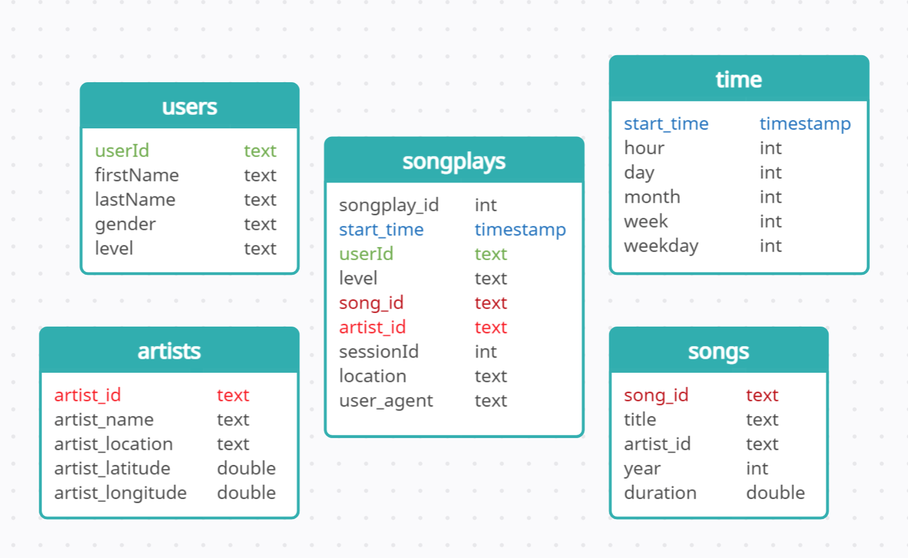

# Data Lake Project

<br>
<br>

## **Introduction**
A music streaming startup, Sparkify, has grown their user base and song database even more and want to move their data warehouse to a data lake. Their data resides in S3, in a directory of JSON logs on user activity on the app, as well as a directory with JSON metadata on the songs in their app.

As their data engineer, you are tasked with building an ETL pipeline that extracts their data from S3, processes them using Spark, and loads the data back into S3 as a set of dimensional tables. This will allow their analytics team to continue finding insights in what songs their users are listening to.


<br>
<br>

## **Project description**
In this project, I'll use Spark and data lakes to build an ETL pipeline for a data lake hosted on S3. I will load data from a AWS S3 bucket, process the data into analytics tables using Spark, and load them back into S3. I'll deploy this Spark process on a cluster using AWS.

<br>
<br>

## **Project Datasets**
I will be working with two datasets that are stored on AWS S3.

<br>

### Song Dataset  
The first dataset is a subset of real data from the Million Song Dataset. Each file is in JSON format and contains metadata about a song and the artist of that song. The files are partitioned by the first three letters of each song's track ID. For example, here are filepaths to two files in this dataset.
```
song_data/A/B/C/TRABCEI128F424C983.json
song_data/A/A/B/TRAABJL12903CDCF1A.json
```
And below is an example of what a single song file, TRAABJL12903CDCF1A.json, looks like.
```json
{"num_songs": 1, "artist_id": "ARJIE2Y1187B994AB7", "artist_latitude": null, "artist_longitude": null, "artist_location": "", "artist_name": "Line Renaud", "song_id": "SOUPIRU12A6D4FA1E1", "title": "Der Kleine Dompfaff", "duration": 152.92036, "year": 0}
```  

<br>

### Log Dataset
The second dataset consists of log files in JSON format generated by this [event simulator](https://github.com/Interana/eventsim) based on the songs in the dataset above. These simulate app activity logs from an imaginary music streaming app based on configuration settings.

The log files in the dataset you'll be working with are partitioned by year and month. For example, here are filepaths to two files in this dataset.
```
log_data/2018/11/2018-11-12-events.json
log_data/2018/11/2018-11-13-events.json
```
And below is an example of what the data in a log file, 2018-11-12-events.json, looks like.


<br>
<br>

## **Database schema**

<br>



<br>
<br>

## **Pipeline Flow**

<br>

1. Data is uploaded to or stored on AWS S3.

2. Data is processed using a AWS EMR cluster and parquet tables data is extracted as follows:

    - songs_table and artist_table data is extracted from the json files in the songs_data folder.

    - users_table, time_table and songplays_table data is extracted from json files in the log_data folder.

3. Generated parquet tables are saved to AWS S3.

<br>
<br>

## **Explanation of the files in the project**

- `etl.py`
  - This script orchestrates the ETL task in the project. 

- `dl.cfg`
  - This file contains examples of the necessary credentials required for the project.